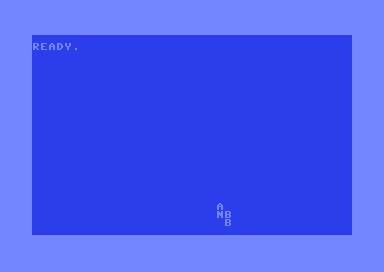

# C64 Horizon Warp

C64 Horizon Warp is a self-contained Commodore 64 PAL demo assembled with [ACME](https://sourceforge.net/projects/acme-crossass/). It is structured from a supplied collection of DeepSeek-named C64 source variants, with the newest self-contained, buildable `SYS 4096` implementation selected as the canonical release.

The runtime uses raster-polled timing rather than a custom raster IRQ chain. It draws a blue-themed logo scene with a smooth text scroller, colour waves, sprite motion, plasma, and raster-bar sections while keeping IRQs disabled during the effect.



## Release status

The canonical source builds cleanly with ACME, produces a CBM BASIC PRG with `SYS 4096`, and was autostarted successfully in PAL VICE for the screenshot above. Historical source and prebuilt variants are retained under `archive/` for provenance; they are not presented as equivalent release candidates.

## Features

- BASIC `RUN` loader that transfers control to `$1000` (`SYS 4096`).
- PAL raster-polled frame pacing with no custom IRQ handler required at runtime.
- ROM character-set copy and a modified in-RAM character set at `$2000`.
- Smooth bottom text scroller, animated logo shine, and colour-wave treatment.
- Sprite motion, plasma colour updates, and raster-bar sections scheduled at fixed raster positions.
- A self-contained source file: the selected implementation has no missing binary/font dependency.
- Checked-in variant audit documenting why the selected source is canonical.

## Build and run

Requirements:

- ACME on your `PATH`.
- VICE `x64sc` on your `PATH` for `make run`.

```sh
make
make check
make run
```

The generated program is `build/c64-horizon-warp.prg`. To run it on hardware, load the PRG and enter `RUN`.

## Runtime design

The `Start` routine begins at `$1000`, disables CIA and VIC IRQ sources, sets a harmless NMI vector, configures VIC bank 0, clears display memory, copies the ROM character set, initializes visual state, and draws the initial logo/borders. `MainLoop` then synchronizes on each PAL frame start and runs its visual sections at raster lines 50, 120, 170, and 220.

This architecture favors predictability over background IRQ scheduling: each frame is rendered by one foreground loop, with explicit raster waits between visual sections. See [architecture notes](docs/architecture.md) for the memory layout and timing model.

## Controls

The selected safe/no-IRQ release has no interactive controls. Its `KeyPoll` routine intentionally returns immediately, so it is suitable as a non-interactive demo loop.

## Repository layout

```text
src/
  c64-horizon-warp.s          Canonical, self-contained ACME source
assets/
  c64-horizon-warp-live.png   Verified native VICE capture
archive/
  sources/                     Supplied historical sources, retained unchanged
  prebuilt/                    Supplied PRGs without an equivalent canonical source
docs/
  architecture.md              Boot, memory, and raster-polled runtime design
  variant-audit.md             Build matrix and canonical-source decision
Makefile                        ACME build, validation, VICE launch, cleanup
```

## Verification

```sh
make clean
make
make check
git diff --check
git fsck --no-reflogs
```

For a runtime check, use `make run` in a PAL VICE configuration and let the demo progress through several frames. The expected presentation is a continuous effect loop; no keyboard action is required.

## Variant provenance

The source set includes several versions that either rely on a missing `custom_charset_1bpp.bin` asset or do not assemble due to source errors. They remain in `archive/` so the history is auditable. The full matrix, including exact compile outcomes, is in [docs/variant-audit.md](docs/variant-audit.md).

## Naming and reuse

The repository is named **C64 Horizon Warp**. The canonical source retains its supplied technical filename in version history; it was copied without altering its code. No license file was supplied with the source collection, so reuse terms have not been asserted or inferred.
